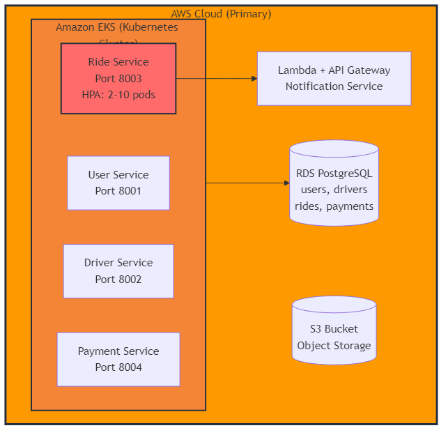
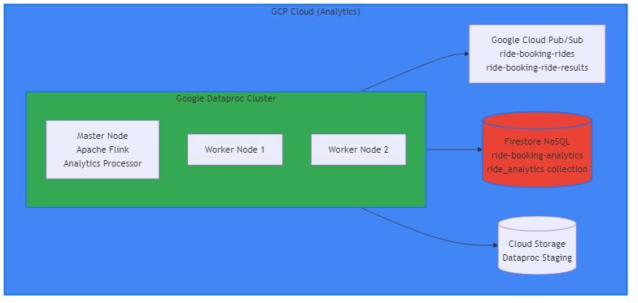
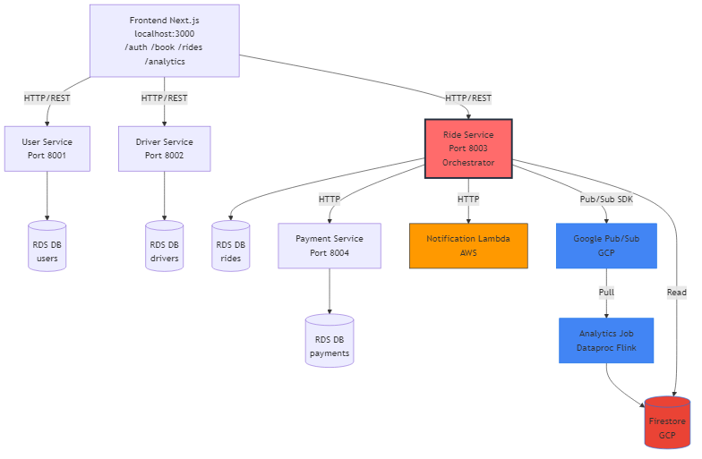
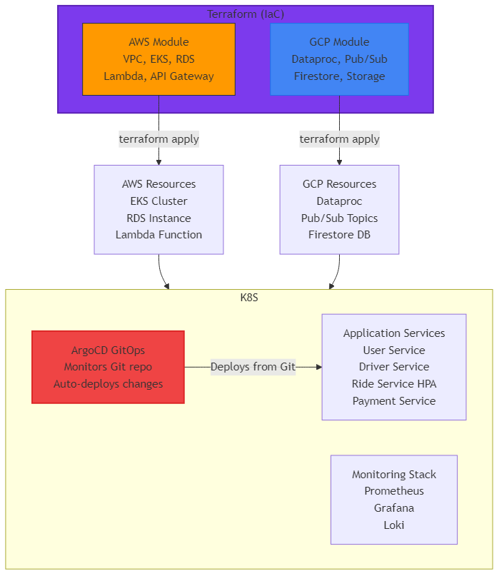
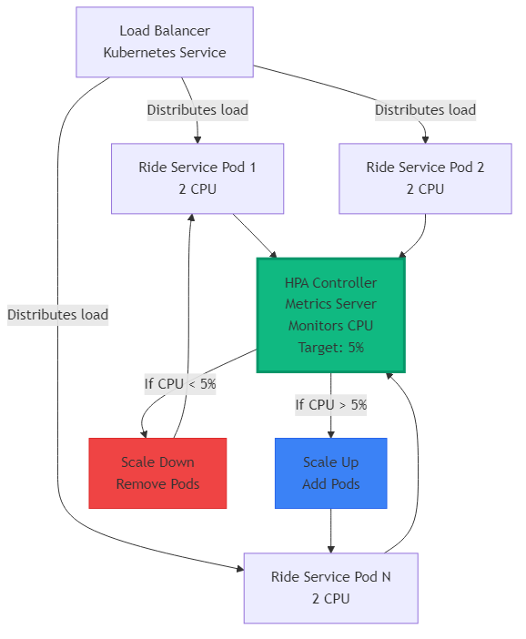

# System Design Document - Ride Booking Platform

**Multi-Cloud Microservices Architecture for Real-Time Ride Booking and Analytics**

---

## Table of Contents

1. [System Overview](#1-system-overview)
2. [Cloud Deployment Architecture](#2-cloud-deployment-architecture)
3. [Microservices Architecture](#3-microservices-architecture)
4. [Microservice Responsibilities](#4-microservice-responsibilities)
5. [Interconnection Mechanisms](#5-interconnection-mechanisms)
6. [Design Rationale](#6-design-rationale)
7. [Architecture Diagrams](#7-architecture-diagrams)

---

## 1. System Overview

### 1.1 Purpose

The Ride Booking Platform is a cloud-native, multi-cloud microservices application designed to demonstrate modern cloud computing principles. The system enables users to book rides, manages driver profiles, processes payments, and provides real-time analytics on ride patterns across different cities.

### 1.2 Key Characteristics

- **Multi-Cloud Architecture**: Spans AWS (primary) and GCP (analytics)
- **Microservices-Based**: 6 independent, loosely coupled services
- **Real-Time Processing**: Stream processing for analytics using Apache Flink
- **Auto-Scaling**: Kubernetes HPA for dynamic resource management
- **Infrastructure as Code**: Complete Terraform-based provisioning
- **GitOps**: ArgoCD for continuous deployment
- **Observability**: Prometheus, Grafana, and Loki for monitoring

### 1.3 Technology Stack

| Layer | Technology |
|-------|-----------|
| **Application Framework** | FastAPI (Python 3.10+) |
| **Frontend** | Next.js 14 (TypeScript, React) |
| **Container Orchestration** | Kubernetes (AWS EKS) |
| **Primary Database** | PostgreSQL (AWS RDS) |
| **Analytics Database** | Firestore (GCP NoSQL) |
| **Message Broker** | Google Cloud Pub/Sub |
| **Stream Processing** | Apache Flink (Python) |
| **Compute Platform** | Google Dataproc |
| **Serverless** | AWS Lambda |
| **Infrastructure as Code** | Terraform |
| **GitOps** | ArgoCD |
| **Monitoring** | Prometheus + Grafana |
| **Load Testing** | k6 |

---

## 2. Cloud Deployment Architecture

### 2.1 Multi-Cloud Strategy

The system employs a **hybrid multi-cloud architecture** with clear separation of concerns:

- **AWS (Provider A)**: Primary infrastructure for application services, transactional data, and serverless functions
- **GCP (Provider B)**: Analytics and stream processing workloads

### 2.2 AWS Infrastructure Components



**Key AWS Services:**
- **EKS Cluster**: Kubernetes 1.28, 2-10 nodes (t3.medium)
- **RDS PostgreSQL**: db.t3.micro, 20GB storage, encrypted
- **Lambda**: Python 3.11, 128MB memory, 30s timeout
- **API Gateway**: REST API for Lambda invocation
- **S3**: Object storage for artifacts and state
- **VPC**: Public/private subnets, NAT Gateway

### 2.3 GCP Infrastructure Components



**Key GCP Services:**
- **Dataproc**: Managed Hadoop/Spark cluster, Flink 1.18.1
- **Pub/Sub**: Managed message broker for event streaming
- **Firestore**: NoSQL document database for analytics
- **Cloud Storage**: Object storage for Dataproc artifacts
- **Cloud NAT**: Network address translation for outbound traffic

### 2.4 Cross-Cloud Communication


**Communication Patterns:**
1. **Synchronous HTTP**: Service-to-service calls within EKS (Kubernetes DNS)
2. **Asynchronous Pub/Sub**: Cross-cloud event streaming (AWS → GCP)
3. **REST API**: Frontend to backend services (port-forwarded)
4. **Database Queries**: Direct connections to RDS and Firestore

---

## 3. Microservices Architecture

### 3.1 Service Decomposition

The system is decomposed into **6 microservices**, each with a single, well-defined responsibility:



### 3.2 Service Communication Matrix

| From Service | To Service | Protocol | Pattern | Purpose |
|--------------|------------|----------|---------|---------|
| Frontend | User Service | HTTP/REST | Request-Response | User registration, login |
| Frontend | Driver Service | HTTP/REST | Request-Response | Driver profile management |
| Frontend | Ride Service | HTTP/REST | Request-Response | Book ride, view rides |
| Ride Service | Payment Service | HTTP/REST | Synchronous | Process payment |
| Ride Service | Lambda | HTTP/REST | Asynchronous | Send notification |
| Ride Service | Pub/Sub | Pub/Sub SDK | Asynchronous | Publish ride event |
| Analytics | Pub/Sub | Pub/Sub SDK | Pull | Consume ride events |
| Analytics | Firestore | Firestore SDK | Write | Store aggregated data |
| Ride Service | Firestore | Firestore SDK | Read | Query analytics |
| All Services | RDS | PostgreSQL | Direct Connection | CRUD operations |

---

## 4. Microservice Responsibilities

### 4.1 User Service

**Location**: AWS EKS (Kubernetes)  
**Port**: 8001  
**Technology**: FastAPI (Python)

**Responsibilities:**
- User registration and authentication
- User profile management (CRUD operations)
- City management (list cities, add cities)
- Session management
- User data validation

**Database Schema:**
```sql
CREATE TABLE users (
    id SERIAL PRIMARY KEY,
    username VARCHAR(100) UNIQUE NOT NULL,
    email VARCHAR(255) UNIQUE NOT NULL,
    password_hash VARCHAR(255) NOT NULL,
    city VARCHAR(100),
    created_at TIMESTAMP DEFAULT CURRENT_TIMESTAMP
);
```

**Key Endpoints:**
- `POST /users/register` - Register new user
- `POST /users/login` - Authenticate user
- `GET /users/{user_id}` - Get user profile
- `GET /cities` - List all cities

**Dependencies:**
- RDS PostgreSQL (users, cities tables)
- No external service dependencies

---

### 4.2 Driver Service

**Location**: AWS EKS (Kubernetes)  
**Port**: 8002  
**Technology**: FastAPI (Python)

**Responsibilities:**
- Driver profile management
- Driver status management (online/offline)
- Vehicle information management
- Driver availability tracking
- Driver data validation

**Database Schema:**
```sql
CREATE TABLE drivers (
    id SERIAL PRIMARY KEY,
    name VARCHAR(255) NOT NULL,
    email VARCHAR(255) UNIQUE NOT NULL,
    phone VARCHAR(20),
    vehicle_type VARCHAR(50),
    vehicle_number VARCHAR(50),
    status VARCHAR(20) DEFAULT 'offline',
    city VARCHAR(100),
    created_at TIMESTAMP DEFAULT CURRENT_TIMESTAMP
);
```

**Key Endpoints:**
- `POST /drivers/register` - Register new driver
- `GET /drivers/{driver_id}` - Get driver profile
- `PUT /drivers/{driver_id}/status` - Update driver status
- `GET /drivers/available` - List available drivers

**Dependencies:**
- RDS PostgreSQL (drivers table)
- No external service dependencies

---

### 4.3 Ride Service (Orchestrator)

**Location**: AWS EKS (Kubernetes)  
**Port**: 8003  
**Technology**: FastAPI (Python)  
**HPA**: 2-10 pods, 5% CPU threshold

**Responsibilities:**
- **Primary Orchestrator**: Coordinates ride booking workflow
- Ride creation and management
- Orchestrates payment processing
- Triggers notifications (asynchronous)
- Publishes ride events to Pub/Sub for analytics
- Queries analytics from Firestore
- Ride status management

**Database Schema:**
```sql
CREATE TABLE rides (
    id SERIAL PRIMARY KEY,
    rider_id INTEGER NOT NULL,
    driver_id INTEGER NOT NULL,
    pickup VARCHAR(255) NOT NULL,
    drop_location VARCHAR(255) NOT NULL,
    city VARCHAR(100) NOT NULL,
    status VARCHAR(50) DEFAULT 'started',
    created_at TIMESTAMP DEFAULT CURRENT_TIMESTAMP
);
```

**Key Endpoints:**
- `POST /ride/start` - Create new ride (orchestrates payment, notification, Pub/Sub)
- `GET /ride/all` - List all rides
- `GET /ride/{ride_id}` - Get ride details
- `GET /analytics/latest` - Get latest analytics from Firestore

**Workflow (POST /ride/start):**
1. Store ride in RDS PostgreSQL
2. Call Payment Service (synchronous HTTP)
3. Call Notification Lambda (asynchronous HTTP, can fail)
4. Publish event to Google Pub/Sub (asynchronous, can fail)
5. Return success response

**Dependencies:**
- RDS PostgreSQL (rides table)
- Payment Service (HTTP)
- AWS Lambda via API Gateway (HTTP)
- Google Pub/Sub (SDK)
- Google Firestore (SDK for analytics queries)

---

### 4.4 Payment Service

**Location**: AWS EKS (Kubernetes)  
**Port**: 8004  
**Technology**: FastAPI (Python)

**Responsibilities:**
- Payment processing (dummy implementation for demo)
- Transaction management
- Payment status tracking
- Payment validation

**Database Schema:**
```sql
CREATE TABLE payments (
    id SERIAL PRIMARY KEY,
    ride_id INTEGER NOT NULL,
    amount DECIMAL(10, 2) NOT NULL,
    status VARCHAR(50) DEFAULT 'PENDING',
    transaction_id VARCHAR(255),
    created_at TIMESTAMP DEFAULT CURRENT_TIMESTAMP
);
```

**Key Endpoints:**
- `POST /payment/process` - Process payment for a ride
- `GET /payment/{payment_id}` - Get payment details
- `GET /payment/ride/{ride_id}` - Get payment for a ride

**Dependencies:**
- RDS PostgreSQL (payments table)
- No external service dependencies

**Note**: This is a dummy payment service for demonstration purposes. In production, it would integrate with payment gateways (Stripe, PayPal, etc.).

---

### 4.5 Notification Service (Lambda)

**Location**: AWS Lambda (Serverless)  
**Trigger**: HTTP via API Gateway  
**Technology**: Python 3.11

**Responsibilities:**
- Asynchronous notification processing
- Logging notifications to CloudWatch
- Ride event notifications
- Can be disabled during load testing

**Function Code:**
```python
def lambda_handler(event, context):
    ride_id = event.get('ride_id')
    city = event.get('city')
    
    # Log notification to CloudWatch
    print(f"Notification: Ride {ride_id} created in {city}")
    
    return {
        'statusCode': 200,
        'body': json.dumps('Notification sent')
    }
```

**API Gateway Endpoint:**
- `POST /notify` - Trigger notification

**Dependencies:**
- AWS CloudWatch (logging)
- No database dependencies

**Design Choice**: Lambda is used to demonstrate serverless architecture. Notifications are fire-and-forget, so failures don't affect ride creation.

---

### 4.6 Analytics Service (Flink on Dataproc)

**Location**: Google Dataproc (GCP)  
**Technology**: Apache Flink 1.18.1 (Python)

**Responsibilities:**
- Real-time stream processing
- Consume ride events from Google Pub/Sub
- Aggregate rides by city with time windows (60-second windows)
- Write aggregated results to Firestore
- Publish results to Pub/Sub (optional)

**Processing Logic:**
```python
# Pseudo-code
1. Subscribe to Pub/Sub topic: ride-booking-rides
2. For each message:
   - Extract city from ride event
   - Increment count for that city
3. Every 60 seconds (tumbling window):
   - Flush aggregates to Firestore
   - Document structure: {city, count, timestamp}
   - Clear aggregates for next window
```

**Output Format:**
```json
{
  "city": "Mumbai",
  "count": 45,
  "timestamp": "2024-01-15T10:30:00Z",
  "windowEnd": "2024-01-15T10:30:00Z"
}
```

**Dependencies:**
- Google Pub/Sub (input subscription)
- Google Firestore (output database)
- Google Pub/Sub (optional output topic)

**Design Choice**: Flink is chosen for its low-latency stream processing capabilities and built-in windowing functions. Dataproc provides managed infrastructure, eliminating cluster management overhead.

---

## 5. Interconnection Mechanisms

### 5.1 Synchronous Communication

#### 5.1.1 HTTP/REST (Service-to-Service)

**Pattern**: Request-Response  
**Protocol**: HTTP/1.1  
**Format**: JSON

**Use Cases:**
- Frontend → Backend Services
- Ride Service → Payment Service
- Ride Service → Notification Lambda (via API Gateway)

**Example:**
```python
# Ride Service calling Payment Service
async with httpx.AsyncClient() as client:
    response = await client.post(
        "http://payment-service:8004/payment/process",
        json={"ride_id": ride_id, "amount": 100.0},
        timeout=5.0
    )
```

**Service Discovery:**
- Within Kubernetes: Kubernetes DNS (`service-name.namespace.svc.cluster.local`)
- External: Environment variables or ConfigMaps

**Error Handling:**
- Timeout: 5 seconds
- Retry: Not implemented (fail-fast for demo)
- Fallback: Continue ride creation even if payment fails (demo mode)

---

#### 5.1.2 Database Connections

**Pattern**: Direct Connection  
**Protocol**: PostgreSQL wire protocol

**Use Cases:**
- All services → RDS PostgreSQL
- Ride Service → Firestore (for analytics queries)

**Connection Pooling:**
- Each service maintains its own connection pool
- Connection string from Kubernetes Secrets

**Example:**
```python
# RDS Connection
conn = psycopg2.connect(
    host=DB_HOST,  # From Secret
    database=DB_NAME,
    user=DB_USER,
    password=DB_PASSWORD,
    port=DB_PORT
)
```

---

### 5.2 Asynchronous Communication

#### 5.2.1 Google Cloud Pub/Sub

**Pattern**: Publish-Subscribe  
**Protocol**: gRPC/HTTP (Pub/Sub SDK)

**Use Cases:**
- Ride Service → Pub/Sub (publish ride events)
- Analytics Service → Pub/Sub (consume ride events)

**Topics:**
- `ride-booking-rides`: Input topic for ride events
- `ride-booking-ride-results`: Output topic for aggregated results (optional)

**Subscription:**
- `ride-booking-rides-flink`: Pull subscription for Analytics Service

**Message Format:**
```json
{
  "ride_id": 123,
  "rider_id": 1,
  "driver_id": 2,
  "pickup": "Location A",
  "drop": "Location B",
  "city": "Mumbai",
  "timestamp": "2024-01-15T10:30:00Z"
}
```

**Publishing (Ride Service):**
```python
# Initialize publisher
publisher = pubsub_v1.PublisherClient(credentials=credentials)
topic_path = publisher.topic_path(project_id, topic_name)

# Publish message
future = publisher.publish(
    topic_path,
    json.dumps(ride_data).encode("utf-8"),
    city=ride_data.get("city", "unknown")
)
future.result(timeout=10)  # Wait for publish
```

**Consuming (Analytics Service):**
```python
# Initialize subscriber
subscriber = pubsub_v1.SubscriberClient()
subscription_path = subscriber.subscription_path(project_id, subscription_name)

# Pull messages
flow_control = pubsub_v1.types.FlowControl(max_messages=10)
with subscriber:
    streaming_pull_future = subscriber.subscribe(
        subscription_path,
        callback=process_message,
        flow_control=flow_control
    )
    streaming_pull_future.result()
```

**Design Rationale:**
- **Decoupling**: Ride Service doesn't wait for analytics processing
- **Scalability**: Pub/Sub handles high throughput
- **Reliability**: At-least-once delivery guarantee
- **Cross-Cloud**: Enables AWS → GCP communication

---

#### 5.2.2 Firestore (NoSQL Database)

**Pattern**: Document Store  
**Protocol**: Firestore REST API / gRPC

**Use Cases:**
- Analytics Service → Firestore (write aggregated data)
- Ride Service → Firestore (read analytics for frontend)

**Database Structure:**
```
Database: ride-booking-analytics
Collection: ride_analytics
Documents:
  - Document ID: {city}-{timestamp}
  - Fields:
    - city: string
    - count: int
    - timestamp: string
    - windowEnd: string
```

**Writing (Analytics Service):**
```python
db = firestore.Client(project=project_id, database='ride-booking-analytics')
doc_ref = db.collection('ride_analytics').document(f"{city}-{timestamp}")
doc_ref.set({
    'city': city,
    'count': count,
    'timestamp': timestamp,
    'windowEnd': windowEnd
})
```

**Reading (Ride Service):**
```python
db = firestore.Client(project=project_id, database='ride-booking-analytics')
docs = list(db.collection('ride_analytics').stream())

# Aggregate by city
city_aggregates = defaultdict(int)
for doc in docs:
    data = doc.to_dict()
    city_aggregates[data['city']] += data['count']
```

**Design Rationale:**
- **NoSQL**: Flexible schema for analytics data
- **Real-Time**: Low-latency reads for dashboard
- **Scalability**: Handles high write throughput
- **GCP Native**: Seamless integration with Dataproc

---

### 5.3 Service Discovery

#### 5.3.1 Kubernetes DNS

**Pattern**: DNS-based service discovery  
**Format**: `{service-name}.{namespace}.svc.cluster.local`

**Example:**
```python
PAYMENT_SERVICE_URL = "http://payment-service:8004"
# Resolves to: payment-service.default.svc.cluster.local
```

**Benefits:**
- Automatic service discovery
- Load balancing via Kubernetes Service
- No external service registry needed

---

#### 5.3.2 Environment Variables / ConfigMaps

**Pattern**: Configuration-based service URLs

**Example:**
```yaml
# Kubernetes Deployment
env:
  - name: PAYMENT_SERVICE_URL
    value: "http://payment-service:80"
  - name: LAMBDA_API_URL
    valueFrom:
      configMapKeyRef:
        name: app-config
        key: lambda_api_url
```

---

### 5.4 Authentication & Authorization

#### 5.4.1 GCP Service Account

**Pattern**: Service Account JSON credentials  
**Storage**: Kubernetes Secrets (base64 encoded)

**Use Cases:**
- Ride Service → Pub/Sub (publisher credentials)
- Analytics Service → Pub/Sub (subscriber credentials)
- Services → Firestore (read/write credentials)

**Implementation:**
```python
# Decode credentials from Secret
credentials_json = base64.b64decode(PUBSUB_CREDENTIALS_B64).decode("utf-8")
credentials_info = json.loads(credentials_json)
credentials = service_account.Credentials.from_service_account_info(credentials_info)

# Use credentials
publisher = pubsub_v1.PublisherClient(credentials=credentials)
```

---

#### 5.4.2 RDS Credentials

**Pattern**: Username/Password  
**Storage**: Kubernetes Secrets

**Implementation:**
```yaml
env:
  - name: DB_PASSWORD
    valueFrom:
      secretKeyRef:
        name: db-credentials
        key: password
```

---

## 6. Design Rationale

### 6.1 Multi-Cloud Architecture

**Decision**: Use AWS for primary infrastructure and GCP for analytics.

**Rationale:**
1. **Requirement Compliance**: Demonstrates multi-cloud capability as per project requirements
2. **Best-of-Breed**: AWS EKS for container orchestration, GCP Dataproc for managed Flink
3. **Cost Optimization**: Use each provider's strengths (AWS for compute, GCP for analytics)
4. **Vendor Lock-in Mitigation**: Reduces dependency on a single cloud provider
5. **Learning Objective**: Demonstrates cross-cloud integration patterns

**Trade-offs:**
- **Complexity**: Increased operational complexity (two cloud providers)
- **Latency**: Cross-cloud communication adds latency (mitigated by async Pub/Sub)
- **Cost**: Potential data transfer costs (minimal for demo scale)

---

### 6.2 Microservices Architecture

**Decision**: Decompose system into 6 independent microservices.

**Rationale:**
1. **Separation of Concerns**: Each service has a single, well-defined responsibility
2. **Independent Scaling**: Services can scale independently (e.g., HPA on Ride Service)
3. **Technology Flexibility**: Each service can use different technologies (though we use FastAPI for consistency)
4. **Fault Isolation**: Failure in one service doesn't cascade to others
5. **Team Autonomy**: Different teams can own different services

**Trade-offs:**
- **Network Overhead**: Inter-service communication adds latency
- **Operational Complexity**: More services to deploy and monitor
- **Data Consistency**: Distributed transactions are complex (we use eventual consistency)

---

### 6.3 Kubernetes (EKS) for Container Orchestration

**Decision**: Use AWS EKS for deploying microservices.

**Rationale:**
1. **Industry Standard**: Kubernetes is the de-facto standard for container orchestration
2. **Auto-Scaling**: Built-in HPA for automatic scaling based on metrics
3. **Service Discovery**: Kubernetes DNS provides automatic service discovery
4. **Resource Management**: Efficient resource allocation and scheduling
5. **GitOps Support**: ArgoCD integrates seamlessly with Kubernetes

**Alternatives Considered:**
- **ECS**: Less flexible, AWS-specific
- **EC2**: Manual scaling, no orchestration
- **Lambda**: Not suitable for long-running services

---

### 6.4 PostgreSQL (RDS) for Primary Database

**Decision**: Use AWS RDS PostgreSQL for transactional data.

**Rationale:**
1. **ACID Compliance**: Strong consistency for transactional data (users, rides, payments)
2. **Relational Model**: Natural fit for structured data (users, drivers, rides relationships)
3. **Managed Service**: RDS handles backups, patching, and high availability
4. **Mature Ecosystem**: Rich tooling and libraries (psycopg2)
5. **Cost-Effective**: db.t3.micro is sufficient for demo workloads

**Alternatives Considered:**
- **DynamoDB**: NoSQL, eventual consistency (not suitable for transactions)
- **Aurora**: More expensive, overkill for demo
- **Self-Managed PostgreSQL**: Operational overhead

---

### 6.5 Firestore (GCP) for Analytics Storage

**Decision**: Use Firestore for storing aggregated analytics data.

**Rationale:**
1. **NoSQL Flexibility**: Schema-less design for evolving analytics requirements
2. **Real-Time Queries**: Low-latency reads for dashboard updates
3. **GCP Native**: Seamless integration with Dataproc and Pub/Sub
4. **Scalability**: Handles high write throughput from stream processing
5. **Serverless**: No infrastructure management

**Alternatives Considered:**
- **BigQuery**: Better for analytics, but overkill for real-time dashboard
- **Cloud SQL**: Relational, less flexible for analytics
- **MongoDB**: Requires self-management

---

### 6.6 Google Cloud Pub/Sub for Event Streaming

**Decision**: Use Pub/Sub for cross-cloud event streaming.

**Rationale:**
1. **Managed Service**: No infrastructure to manage (unlike self-hosted Kafka)
2. **Cross-Cloud**: Enables AWS → GCP communication
3. **Scalability**: Handles high throughput automatically
4. **Reliability**: At-least-once delivery guarantee
5. **Cost-Effective**: Pay-per-use pricing

**Alternatives Considered:**
- **Kafka (Confluent Cloud)**: More features, but higher cost and complexity
- **AWS SQS/SNS**: AWS-native, but doesn't support GCP consumers well
- **Self-Hosted Kafka**: Operational overhead

---

### 6.7 Apache Flink on Dataproc for Stream Processing

**Decision**: Use Apache Flink on Google Dataproc for real-time analytics.

**Rationale:**
1. **Low Latency**: Flink provides sub-second processing latency
2. **Windowing**: Built-in support for time-windowed aggregations
3. **Managed Infrastructure**: Dataproc handles cluster management
4. **Python Support**: Can use Python (PyFlink) for easier development
5. **Scalability**: Flink scales horizontally

**Alternatives Considered:**
- **Spark Streaming**: Higher latency, batch-oriented
- **Kafka Streams**: Limited to Kafka ecosystem
- **Cloud Dataflow**: GCP-native, but less control

---

### 6.8 AWS Lambda for Notifications

**Decision**: Use AWS Lambda for notification service.

**Rationale:**
1. **Serverless**: No infrastructure management
2. **Cost-Effective**: Pay only for invocations
3. **Auto-Scaling**: Automatically scales to handle load
4. **Requirement Compliance**: Demonstrates serverless architecture
5. **Event-Driven**: Fits asynchronous notification pattern

**Alternatives Considered:**
- **EKS Service**: More control, but requires infrastructure management
- **SNS/SQS**: Simpler, but less flexibility

---

### 6.9 Horizontal Pod Autoscaling (HPA)

**Decision**: Configure HPA for Ride Service with 5% CPU threshold.

**Rationale:**
1. **Cost Optimization**: Scale down during low load
2. **Performance**: Scale up during high load
3. **Demonstration**: Shows Kubernetes auto-scaling capabilities
4. **Load Testing**: Validates scaling behavior under load

**Configuration:**
- **Min Replicas**: 2 (high availability)
- **Max Replicas**: 10 (handle peak load)
- **Metric**: CPU utilization
- **Target**: 5% (aggressive scaling for demo)

**Trade-offs:**
- **Low Threshold**: May cause oscillation (mitigated by HPA stabilization)
- **Warm-up Time**: New pods take time to start (acceptable for demo)

---

### 6.10 Infrastructure as Code (Terraform)

**Decision**: Use Terraform for all infrastructure provisioning.

**Rationale:**
1. **Reproducibility**: Infrastructure can be recreated from code
2. **Version Control**: Infrastructure changes are tracked in Git
3. **Multi-Cloud**: Single tool for AWS and GCP
4. **Requirement Compliance**: Demonstrates IaC best practices
5. **Documentation**: Terraform code serves as infrastructure documentation

**Alternatives Considered:**
- **CloudFormation**: AWS-only, not suitable for multi-cloud
- **Pulumi**: More features, but less mature
- **Manual Setup**: Not reproducible, error-prone

---

### 6.11 GitOps with ArgoCD

**Decision**: Use ArgoCD for GitOps-based deployment.

**Rationale:**
1. **Git as Source of Truth**: All deployments tracked in Git
2. **Automatic Sync**: Changes in Git automatically deploy to cluster
3. **Rollback**: Easy rollback to previous Git commits
4. **Audit Trail**: All deployments logged in Git history
5. **Requirement Compliance**: Demonstrates GitOps practices

**Alternatives Considered:**
- **Helm**: Manual deployment, no Git integration
- **Flux**: Similar to ArgoCD, but ArgoCD has better UI
- **Manual kubectl**: No automation, error-prone

---

### 6.12 Observability Stack (Prometheus + Grafana)

**Decision**: Use Prometheus for metrics and Grafana for visualization.

**Rationale:**
1. **Industry Standard**: Prometheus is the de-facto standard for Kubernetes metrics
2. **Integration**: Prometheus integrates seamlessly with Kubernetes
3. **Rich Dashboards**: Grafana provides powerful visualization
4. **Alerting**: Can set up alerts based on metrics
5. **Open Source**: No vendor lock-in

**Alternatives Considered:**
- **CloudWatch**: AWS-native, but doesn't integrate well with GCP
- **Datadog**: Commercial, expensive
- **New Relic**: Commercial, expensive

---

## 7. Architecture Diagrams

### 7.1 High-Level System Architecture


### 7.2 Data Flow Diagram


### 7.3 Deployment Architecture



### 7.4 Scalability Architecture



---

## Conclusion

This design document provides a comprehensive overview of the Ride Booking Platform's architecture, covering:

1. **System Overview**: Purpose, characteristics, and technology stack
2. **Cloud Deployment Architecture**: Multi-cloud strategy with AWS and GCP
3. **Microservices Architecture**: 6 services with clear responsibilities
4. **Interconnection Mechanisms**: Synchronous HTTP, asynchronous Pub/Sub, and database connections
5. **Design Rationale**: Justification for each architectural decision

The system demonstrates modern cloud-native principles including:
- Multi-cloud deployment
- Microservices architecture
- Infrastructure as Code
- GitOps practices
- Auto-scaling
- Real-time stream processing
- Comprehensive observability

All design choices are justified based on requirements, scalability, cost, and operational considerations.

---

**Document Version**: 1.0  
**Last Updated**: January 2025  
**Author**: System Architecture Team

